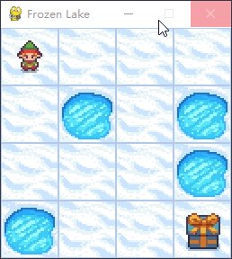

# Q-Learning 算法原理与代码

Q-Learning 是一种基于值的强化学习算法，借助 **动作价值函数** $Q(s, a)$ 来预估在给定状态 $s$ 下采取动作 $a$ 的期望回报。在更新时，Q-Learning 采用贪婪策略，即始终选取最大的 $Q$ 值。

## 1. 基本原理
Q-Learning 的核心思路是运用 **Bellman 最优方程**来更新动作价值函数 $Q(s, a)$。Bellman 最优方程描述了在最优策略下，动作价值函数与下一状态的动作价值函数之间的关联。Q-Learning 通过迭代更新 $Q$ 值，逐步逼近最优动作价值函数。

### 1.1 Bellman 最优方程
Bellman 最优方程刻画了最优策略下动作价值函数与下一状态动作价值函数的关系。对于最优策略 $\pi^*$，有如下公式：

$$Q^*(s, a) = R(s, a) + \gamma \sum_{s'} P(s' \mid s, a) V^*(s')$$

其中：
- $Q^*(s, a)$：最优动作价值函数；
- $R(s, a)$：在状态 $s$ 下采取动作 $a$ 所获得的奖励；
- $\gamma$：折扣因子，取值范围是 $[0, 1]$；
- $P(s' \mid s, a)$：在状态 $s$ 下采取动作 $a$ 后，转移到状态 $s'$ 的概率；
- $V^*(s')$：最优状态价值函数。

### 1.2 最优动作价值函数与最优状态价值函数的关系
最优动作价值函数和最优状态价值函数存在如下关系：

$$V^*(s) = \max_a Q^*(s, a)$$

### 1.3 Q-Learning 更新公式推导
把最优动作价值函数代入 Bellman 最优方程可得：

$$Q^*(s, a) = R(s, a) + \gamma \sum_{s'} P(s' \mid s, a) \max_{a'} Q^*(s', a')$$

在 Q-Learning 里，我们尝试通过迭代更新 $Q$ 值来逼近最优动作价值函数。Q-Learning 的更新公式可表示为：

$$Q_{t + 1}(s, a) = Q_t(s, a) + \alpha \cdot (R(s, a) + \gamma \cdot \max_{a'} Q_t(s', a') - Q_t(s, a))$$

其中：
- $Q_t(s, a)$：第 $t$ 次迭代时的动作价值函数；
- $\alpha$：学习率，取值范围为 $[0, 1]$。

需要注意的是，该公式并非直接从 Bellman 最优方程推导得出，而是依据其形式构建的。Q-Learning 算法通过迭代更新 $Q$ 值，逐步趋近最优动作价值函数。在实际应用中，通常会采用诸如 $\varepsilon$-greedy 之类的策略来平衡探索与利用，从而在学习过程中探寻最优策略。

## 2. Q-Learning 算法流程
Q-Learning 算法的基本步骤如下：
1. 初始化 $Q$ 值表，一般将所有 $Q$ 值设为 0 或者较小的随机数。
2. 针对每个训练回合：
    - 初始化状态 $s_t$。
    - 在状态 $s_t$ 下，依据 $Q$ 值表和探索策略（如 $\varepsilon$-greedy）挑选动作 $a_t$。
    - 执行动作 $a_t$，观察奖励 $R_t$ 和下一状态 $s_{t + 1}$。
    - 运用 Q-Learning 更新公式更新 $Q$ 值表：
$$Q_{t + 1}(s, a) = Q_t(s, a) + \alpha \cdot (R(s, a) + \gamma \cdot \max_{a'} Q_t(s', a') - Q_t(s, a))$$
    - 若未达到回合结束条件，把 $s_{t + 1}$ 设为新的当前状态 $s_t$，并返回步骤 2。
3. 依据 $Q$ 值表执行最优策略。

## 3. 优缺点
### 3.1 优点
- **离线学习**：Q-Learning 属于离线学习算法，这表明智能体能够从过往经验中学习，无需与环境进行实时交互。
- **收敛性**：在有限的状态和动作空间中，Q-Learning 算法可保证收敛到最优策略。
- **易于实现**：Q-Learning 算法相对简单，实现起来较为容易。

### 3.2 缺点
- **状态空间大时不适用**：当状态空间或动作空间较大时，Q-Learning 算法的收敛速度会变慢，甚至可能无法收敛。
- **表格表示法的局限**：Q-Learning 采用表格表示法来存储动作价值函数，在大规模问题中可能会导致内存需求过大。

## 4. 游戏
FrozenLake-v1（gymnasium）是基于 OpenAI Gym 的强化学习环境。在该环境中，智能体要在一个 4x4 的网格世界里行动，从起点 $S$（起始状态）抵达目标 $G$（目标状态），同时要避免掉入 $H$（洞）。

网格世界包含以下单元格：
- $S$：起始状态（Start），即智能体的初始位置。
- $F$：冰冻的表面（Frozen），智能体可在此安全行走。
- $H$：洞（Hole），智能体应避免掉入，否则游戏结束。
- $G$：目标状态（Goal），智能体需要到达的目标位置。

智能体可以执行以下四个动作：
- 0：向左移动（Left）
- 1：向下移动（Down）
- 2：向右移动（Right）
- 3：向上移动（Up）

## 5. 测试效果
- **状态空间**：状态空间有 16 种，维度为 1，表示当前所在位置。
- **动作空间**：动作空间有 4 种，表示上下左右运动方向。





6. 代码

以下是使用 Python 和 Gymnasium 库实现 Q-Learning 算法在 FrozenLake-v1 环境中训练的代码：

```python
import os
import time
from itertools import count
import numpy  as np
import pandas as pd

import gymnasium as gym


class QLearning(object):
    def __init__(self, env, env_play) -> None:
        # == epsilon
        self.max_epsilon = 1      # 探索系数最大值
        self.min_epsilon = 0.05   # 探索系数最小值
        self.epsilon = self.max_epsilon

        # == env
        self.episodes = 20000    # 游戏局数
        self.env = env
        self.env_play = env_play

        # == Q-learning
        self.alpha    = 0.5          
        self.gamma    = 0.95
        self.q_table_csv = './q_table_{}x{}.csv'.format(self.env.observation_space.n, self.env.action_space.n)

        self.q_table = pd.DataFrame(
            np.zeros((self.env.observation_space.n, self.env.action_space.n)),  
            index=range(0, self.env.observation_space.n),     # 对应 环境的维度，observation （0，15）， 也就是position
            columns=range(0, self.env.action_space.n)         # 对应 动作空间维度，action （0，3） 。1表示下，2表示右
            )
            # 整个q_table 表示 当处于 position 位置时，选择哪个方向最可能到达终点
        print(' -------- init. qtable： \n', self.q_table)

    def epsilon_decay(self, episode): 
        a = 7.5  # 比例系数
        epsilon = self.min_epsilon + (self.max_epsilon - self.min_epsilon) * np.exp(-a * episode/ self.episodes)   # 指数衰减
        return epsilon

    def select_action(self, state, greedy=False):
        e = np.random.uniform()
        action = None
        if (e < self.epsilon or (self.q_table.iloc[state] == 0).all()) and not greedy:   
            action = self.env.action_space.sample()
        else:
            action = self.q_table.iloc[state].idxmax()
        return action

    def update_q_table(self, state, action, reward, next_state):    # 计算 state(s), action(a)  --》 next_state(s')  时的动作价值函数 
        # Q_{t+1}(s, a) = Q_t(s, a) + \alpha \cdot (R(s, a) + \gamma \cdot \max_{a'} Q_t(s', a') - Q_t(s, a))
        q = self.q_table.iloc[state][action]       # Q_t(s, a)
        q_new = q + self.alpha * (reward + self.gamma * self.q_table.iloc[next_state].max() - q)    #  时序差分
        self.q_table.iloc[state][action] = q_new

    def train(self):
        for episode in range(self.episodes):
            rewards = []
            successes = []

            observation, info = self.env.reset()
            #observation, info = self.env.reset(seed=42)  # 固定种子

            # ======== For each step
            for step_num in range(100):
                action = self.select_action(observation)
                observation_new, reward, terminated, truncated, info = self.env.step(action)
                #print(' -- episode, step_num, action, observation_new, reward, terminated, truncated, info: ', episode, step_num, action, observation_new, reward, terminated, truncated, info)

                # Truncated在官方定义中用于处理比如超时等特殊结束的情况。
                '''
                observation (ObsType) : 环境观察空间的一个元素，作为代理动作的下一个观察结果
                reward (SupportsFloat) : 采取行动的结果的奖励。 成功到达目的地会得到奖励 1，否则奖励为 0
                terminated (bool) : 代理是否达到最终状态，可以是正数或负数。
                truncated (bool) : 是否满足MDP范围外的截断条件。 通常，这是一个时间限制，但也可用于指示代理实际越界。 可用于在达到最终状态之前提前结束情节。
                info (dict) : 包含辅助诊断信息（有助于调试、学习和记录）。
                '''
                success = reward
                done = terminated or truncated
                if done and reward == 0:  # 调入冰窟 给负分
                    reward = -1

                successes.append(success)
                rewards.append(reward)

                self.update_q_table(observation, action, reward, observation_new)
                observation = observation_new

                if done:
                    self.epsilon = self.epsilon_decay(episode)
                    break

            ave_reward = sum(rewards)/len(rewards)
            ave_successes = sum(successes)/len(successes)
            if episode%1000 == 0: print(' Train ---- episode={}, epsilon={:.3f}, ave_successes={:.3f} ave_reward={:.3f} '.format(episode, self.epsilon, ave_successes, ave_reward))
            #print(' -- q_table:\n',qlearn.q_table)

        # save csv
        self.q_table.to_csv(self.q_table_csv, index=False)

    def test(self):
        #self.env.render(render_mode='human')  # 在这里指定渲染模式
        #self.env.render(mode='human')

        if os.path.exists(self.q_table_csv):
            dtype = dict(zip(np.array([str(x) for x in np.arange(0,self.env_play.action_space.n)]), np.array(['float64'] * self.env_play.action_space.n)))
            self.q_table = pd.read_csv(self.q_table_csv, header=0, dtype=dtype)
            print(' ---- read q_table: \n', self.q_table)

            observation, info = self.env_play.reset()
            #observation, info = self.env_play.reset(seed=42)   # 固定种子

            time.sleep(10)

            step_num = -1
            done = False
            while not done:
                step_num += 1

                action = self.select_action(observation, True)
                observation_new, reward, terminated, truncated, info = self.env_play.step(int(action))
                done = terminated or truncated
                observation = observation_new

                print(' Test ---- step_num, action, reward, observation: ', step_num, action, reward, observation)

                time.sleep(1)


if __name__ == '__main__':

    '''
    固定种子， 无滑动：    一直能通关
    固定种子， 有滑动：    一直能通关
    不固定种子， 无滑动：  一直能通关
    不固定种子， 有滑动：    偶尔能通关 ，且通关步长较大。 （可能是训练不充分）

    （这里的不固定种子，并不是随机开局）
    '''

    # ==== 创建环境
    env = gym.make('FrozenLake-v1', desc=None, map_name='4x4', is_slippery=False)    # 无滑动
    env_play = gym.make('FrozenLake-v1', desc=None, map_name="4x4", is_slippery=False, render_mode='human')

    #env = gym.make('FrozenLake-v1', desc=None, map_name='4x4', is_slippery=True)  # 有滑动
    #env_play = gym.make('FrozenLake-v1', desc=None, map_name="4x4", is_slippery=True, render_mode='human')

    '''
    'FrozenLake-v1'：这是环境的名称，FrozenLake 是一个经典的强化学习问题，代表一个冰冻湖面上的智能体需要在湖面上移动，避开洞口，到达目标位置。这个环境有一个简单的离散状态空间和动作空间。
    desc=None：desc 参数用于指定环境的地图描述。如果设置为 None，则使用 map_name 参数指定的地图。如果提供了一个地图描述，那么将使用这个描述创建环境。
    map_name="4x4"：这个参数指定了环境的地图大小。默认情况下，FrozenLake 环境是一个 4x4 的地图，这里我们将其扩展到 4x4 的大小。
    is_slippery=True：这个参数表示地面是否有滑动效果。如果设置为 True，智能体在执行动作时有一定的概率滑动到非预期的相邻格子。这会使问题更具挑战性，因为智能体需要学会在不确定性条件下做出决策。
    render_mode='human'：这个参数指定了环境的渲染模式。'human' 表示环境将以人类可读的方式呈现，通常是通过图形界面或者命令行输出。这有助于我们观察智能体在环境中的表现。
    '''

    # ==== 初始化算法
    qlearn = QLearning(env, env_play)


    # ==== train
    qlearn.train()

    # ==== test
    qlearn.test()
```

## print：

```python
-------- init. qtable： 
       0    1    2    3
0   0.0  0.0  0.0  0.0
1   0.0  0.0  0.0  0.0
2   0.0  0.0  0.0  0.0
3   0.0  0.0  0.0  0.0
4   0.0  0.0  0.0  0.0
5   0.0  0.0  0.0  0.0
6   0.0  0.0  0.0  0.0
7   0.0  0.0  0.0  0.0
8   0.0  0.0  0.0  0.0
9   0.0  0.0  0.0  0.0
10  0.0  0.0  0.0  0.0
11  0.0  0.0  0.0  0.0
12  0.0  0.0  0.0  0.0
13  0.0  0.0  0.0  0.0
14  0.0  0.0  0.0  0.0
15  0.0  0.0  0.0  0.0
 Train ---- episode=0, epsilon=1.000, ave_successes=0.000 ave_reward=-0.250 
 Train ---- episode=1000, epsilon=0.703, ave_successes=0.000 ave_reward=-0.333 
 Train ---- episode=2000, epsilon=0.499, ave_successes=0.125 ave_reward=0.125 
 Train ---- episode=3000, epsilon=0.358, ave_successes=0.125 ave_reward=0.125 
 Train ---- episode=4000, epsilon=0.262, ave_successes=0.000 ave_reward=-0.500 
 Train ---- episode=5000, epsilon=0.196, ave_successes=0.000 ave_reward=-0.500 
 Train ---- episode=6000, epsilon=0.150, ave_successes=0.167 ave_reward=0.167 
 Train ---- episode=7000, epsilon=0.119, ave_successes=0.167 ave_reward=0.167 
 Train ---- episode=8000, epsilon=0.097, ave_successes=0.167 ave_reward=0.167 
 Train ---- episode=9000, epsilon=0.083, ave_successes=0.100 ave_reward=0.100 
 Train ---- episode=10000, epsilon=0.072, ave_successes=0.167 ave_reward=0.167 
 Train ---- episode=11000, epsilon=0.065, ave_successes=0.000 ave_reward=-0.167 
 Train ---- episode=12000, epsilon=0.061, ave_successes=0.167 ave_reward=0.167 
 Train ---- episode=13000, epsilon=0.057, ave_successes=0.125 ave_reward=0.125 
 Train ---- episode=14000, epsilon=0.055, ave_successes=0.167 ave_reward=0.167 
 Train ---- episode=15000, epsilon=0.053, ave_successes=0.167 ave_reward=0.167 
 Train ---- episode=16000, epsilon=0.052, ave_successes=0.167 ave_reward=0.167 
 Train ---- episode=17000, epsilon=0.052, ave_successes=0.167 ave_reward=0.167 
 Train ---- episode=18000, epsilon=0.051, ave_successes=0.167 ave_reward=0.167 
 Train ---- episode=19000, epsilon=0.051, ave_successes=0.125 ave_reward=0.125 
 ---- read q_table: 
            0         1         2         3
0   0.735092  0.773781  0.773781  0.735092
1   0.735092 -1.000000  0.814506  0.773781
2   0.773781  0.857375  0.773781  0.814506
3   0.814506 -1.000000  0.773781  0.773781
4   0.773781  0.814506 -1.000000  0.735092
5   0.000000  0.000000  0.000000  0.000000
6  -1.000000  0.902500 -1.000000  0.814506
7   0.000000  0.000000  0.000000  0.000000
8   0.814506 -1.000000  0.857375  0.773781
9   0.814506  0.902500  0.902500 -1.000000
10  0.857375  0.950000 -1.000000  0.857375
11  0.000000  0.000000  0.000000  0.000000
12  0.000000  0.000000  0.000000  0.000000
13 -1.000000  0.902500  0.950000  0.857375
14  0.902500  0.950000  1.000000  0.902500
15  0.000000  0.000000  0.000000  0.000000
 Test ---- step_num, action, reward, observation:  0 1 0.0 4
 Test ---- step_num, action, reward, observation:  1 1 0.0 8
 Test ---- step_num, action, reward, observation:  2 2 0.0 9
 Test ---- step_num, action, reward, observation:  3 1 0.0 13
 Test ---- step_num, action, reward, observation:  4 2 0.0 14
 Test ---- step_num, action, reward, observation:  5 2 1.0 15
```

