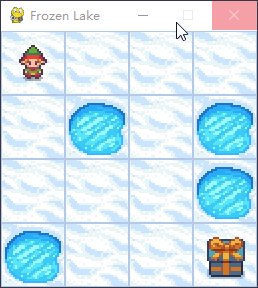

# SARSA 算法原理与代码

## 1. 基本原理
SARSA（State - Action - Reward - State - Action）是一种 **基于时序差分（TD）** 学习的在线强化学习算法。它通过智能体与环境的交互来学习动作价值函数（Q 函数），该函数用于评估在给定状态下采取特定动作的价值。

### 1.1 时序差分学习
时序差分学习是强化学习中一种介于蒙特卡罗方法和动态规划之间的方法。它融合了蒙特卡罗方法的样本更新和动态规划的自举更新特性。在时序差分学习里，智能体每一步更新价值函数时，只需观察当前状态、动作、奖励以及下一个状态。

### 1.2 SARSA 更新动作价值函数
SARSA 动作价值函数更新公式如下：

$$Q_{t + 1}(s, a)=Q_t(s, a)+\alpha\cdot(R(s, a)+\gamma\cdot Q_t(s', a') - Q_t(s, a))$$

其中：
- $Q(s, a)$ 是当前状态 $s_t$ 和动作 $a_t$ 的动作价值。
- $\alpha$ 是学习率，它控制着价值函数更新的速度。
- $R(s, a)$ 是智能体执行动作 $a$ 后获得的奖励。
- $\gamma$ 是折扣因子，用于衡量未来奖励相对于即时奖励的重要性。
- $Q_t(s', a')$ 是下一个状态 $s'$ 和相应动作 $a'$ 的动作价值。

### 1.3 与 Q - Learning 对比
Q - Learning 和 SARSA 均为基于时序差分学习的强化学习算法，不过它们的动作价值函数更新规则存在细微差异。下面详细解释二者的区别。

#### Q - Learning
Q - Learning 是一种离线（off - policy）学习算法。在更新 Q 函数时，它使用下一个状态 $s'$ 的最大动作价值：$\max_{a'} Q_t(s', a')$。这意味着 Q - Learning 不关注智能体实际采取的下一个动作，而是假定智能体在下一个状态会采取具有最大动作价值的动作。这种特性使得 Q - Learning 能够学习到最优策略，且不受当前策略的影响。

#### SARSA
与 Q - Learning 不同，SARSA 是一种在线（on - policy）学习算法。在更新 Q 函数时，它使用智能体实际采取的下一个动作 $a'$ 的动作价值：$Q_t(s', a')$。这表明 SARSA 在学习过程中会考虑智能体当前的策略，所以 SARSA 学到的策略与智能体在训练过程中实际执行的策略紧密相关。

#### 区别
Q - Learning 和 SARSA 的主要区别在于它们处理下一个状态动作价值的方式。Q - Learning 假设智能体总是采取最佳动作，这可能导致它过于乐观地估计动作价值。而 SARSA 考虑了智能体实际采取的动作，其估计可能更接近实际情况。这使得 Q - Learning 更倾向于学习最优策略，而 SARSA 更倾向于学习一个与当前策略相适应的策略。

## 2. 算法流程
SARSA 算法的基本流程如下：
1. 初始化 Q 函数为任意值，通常将其设置为 0。
2. 对于每个训练回合：
    - 初始化状态 $s$。
    - 选择动作 $a$，通常采用 ε - 贪婪策略。
    - 直到回合结束：
        - 执行动作 $a$，观察奖励 $r'$ 和下一个状态 $s'$。
        - 选择下一个动作 $a'$，通常使用 ε - 贪婪策略。
        - 使用 SARSA 更新规则更新 Q 函数。
        - 更新状态 $s = s'$ 和动作 $a = a'$。

## 3. 优缺点
### 3.1 优点
- **在线学习**：SARSA 是在线学习算法，智能体在与环境交互过程中持续更新价值函数，能适应不断变化的环境。
- **易于实现**：SARSA 算法相对简单，便于实现和理解。

### 3.2 缺点
- **高方差**：由于是在线学习算法，其估计可能受环境中噪声的影响，导致方差较高。
- **较慢的收敛速度**：相较于其他强化学习算法，SARSA 的收敛速度可能较慢。

综上所述，SARSA 是一种基于时序差分学习的强化学习算法，适用于在线学习场景。尽管它存在一定局限性，但在某些问题上表现良好，且易于实现。

## 4. 游戏
FrozenLake - v1（gymnasium）是基于 OpenAI Gym 的强化学习环境。在该环境中，智能体要在一个 4x4 的网格世界里行动，从起点 S（起始状态）到达目标 G（目标状态），同时要避免掉入 H（洞）。

智能体可执行以下四个动作：
- 0：向左移动（Left）
- 1：向下移动（Down）
- 2：向右移动（Right）
- 3：向上移动（Up）

## 5. 测试效果
- **状态空间**：状态空间有 16 种，维度为 1，表示当前所在位置。
- **动作空间**：动作空间有 4 种，表示上下左右运动方向。





## 6. 代码

下面是使用 Python 和 Gymnasium 库实现 SARSA 算法在 FrozenLake - v1 环境中训练的代码：


```python
import os
import time
from itertools import count
import numpy  as np
import pandas as pd

import gymnasium as gym


class SARSA(object):
    def __init__(self, env, env_play) -> None:
        # == epsilon
        self.max_epsilon = 1      # 探索系数最大值
        self.min_epsilon = 0.05   # 探索系数最小值
        self.epsilon = self.max_epsilon

        # == env
        self.episodes = 20000    # 游戏局数
        self.env = env
        self.env_play = env_play

        # == Q-learning
        self.alpha    = 0.5          
        self.gamma    = 0.95
        self.q_table_csv = './q_table_{}x{}.csv'.format(self.env.observation_space.n, self.env.action_space.n)

        self.q_table = pd.DataFrame(
            np.zeros((self.env.observation_space.n, self.env.action_space.n)),  
            index=range(0, self.env.observation_space.n),     # 对应 环境的维度，observation （0，15）， 也就是position
            columns=range(0, self.env.action_space.n)         # 对应 动作空间维度，action （0，3） 。1表示下，2表示右
            )
            # 整个q_table 表示 当处于 position 位置时，选择哪个方向最可能到达终点

        # == train
        self.best_ave_reward = -1
        self.best_q_table = None

        print(' -------- init. qtable： \n', self.q_table)

    def epsilon_decay(self, episode): 
        a = 7.5  # 比例系数
        epsilon = self.min_epsilon + (self.max_epsilon - self.min_epsilon) * np.exp(-a * episode/ self.episodes)   # 指数衰减
        return epsilon

    def select_action(self, state, greedy=False):
        e = np.random.uniform()
        action = None
        if (e < self.epsilon or (self.q_table.iloc[state] == 0).all()) and not greedy:   
            action = self.env.action_space.sample()
        else:
            action = self.q_table.iloc[state].idxmax()
        return action

    def update_q_table(self, state, action, reward, next_state, next_action):    # 计算 state (s), action (a) --》 next_state (s'), next_state (a') 时的动作价值函数 
        # Q_{t+1}(s, a) = Q_t(s, a) + \alpha \cdot (R(s, a) + \gamma \cdot \max_{a'} Q_t(s', a') - Q_t(s, a))
        q = self.q_table.iloc[state][action]       # Q(s_t, a_t)
        #q_new = q + self.alpha * (reward + self.gamma * self.q_table.iloc[next_state].max() - q)    #  Q-learning
        q_new = q + self.alpha * (reward + self.gamma * self.q_table.iloc[next_state, next_action] - q)  # SARSA
        self.q_table.iloc[state][action] = q_new

    def train(self):
        for episode in range(self.episodes):
            rewards = []
            successes = []

            observation, info = self.env.reset()
            #observation, info = self.env.reset(seed=42)  # 固定种子

            action = self.select_action(observation)
            # ======== For each step
            for step_num in range(100):

                observation_new, reward, terminated, truncated, info = self.env.step(action)
                action_new = self.select_action(observation_new)
                #print(' -- episode, step_num, action, observation_new, reward, terminated, truncated, info: ', episode, step_num, action, observation_new, reward, terminated, truncated, info)

                # Truncated在官方定义中用于处理比如超时等特殊结束的情况。
                '''
                observation (ObsType) : 环境观察空间的一个元素，作为代理动作的下一个观察结果
                reward (SupportsFloat) : 采取行动的结果的奖励。 成功到达目的地会得到奖励 1，否则奖励为 0
                terminated (bool) : 代理是否达到最终状态，可以是正数或负数。
                truncated (bool) : 是否满足MDP范围外的截断条件。 通常，这是一个时间限制，但也可用于指示代理实际越界。 可用于在达到最终状态之前提前结束情节。
                info (dict) : 包含辅助诊断信息（有助于调试、学习和记录）。
                '''
                success = reward
                done = terminated or truncated
                if done and reward == 0:  # 调入冰窟 给负分
                    reward = -1


                self.update_q_table(observation, action, reward, observation_new, action_new)
                observation = observation_new
                action = action_new

                successes.append(success)
                rewards.append(reward)

                if done:
                    self.epsilon = self.epsilon_decay(episode)
                    break

            ave_reward = sum(rewards)/len(rewards)
            ave_successes = sum(successes)/len(successes)

            if ave_reward > self.best_ave_reward:
                self.best_ave_reward = ave_reward
                self.best_q_table = self.q_table


            if episode%1000 == 0: print(' Train ---- episode={}, epsilon={:.3f}, ave_successes={:.3f} ave_reward={:.3f} '.format(episode, self.epsilon, ave_successes, ave_reward))
            #print(' -- q_table:\n',qlearn.q_table)

        # save csv
        self.best_q_table.to_csv(self.q_table_csv, index=False)

    def test(self):
        #self.env.render(render_mode='human')  # 在这里指定渲染模式
        #self.env.render(mode='human')

        if os.path.exists(self.q_table_csv):
            dtype = dict(zip(np.array([str(x) for x in np.arange(0,self.env_play.action_space.n)]), np.array(['float64'] * self.env_play.action_space.n)))
            self.q_table = pd.read_csv(self.q_table_csv, header=0, dtype=dtype)
            print(' ---- read q_table: \n', self.q_table)

            observation, info = self.env_play.reset()
            #observation, info = self.env_play.reset(seed=42)   # 固定种子

            time.sleep(10)

            step_num = -1
            done = False
            while not done:
                step_num += 1

                action = self.select_action(observation, True)
                observation_new, reward, terminated, truncated, info = self.env_play.step(int(action))
                done = terminated or truncated
                observation = observation_new

                print(' Test ---- step_num, action, reward, observation: ', step_num, action, reward, observation)

                time.sleep(1)


if __name__ == '__main__':

    # ==== 创建环境
    env = gym.make('FrozenLake-v1', desc=None, map_name='4x4', is_slippery=False)    # 无滑动
    env_play = gym.make('FrozenLake-v1', desc=None, map_name="4x4", is_slippery=False, render_mode='human')

    #env = gym.make('FrozenLake-v1', desc=None, map_name='4x4', is_slippery=True)  # 有滑动
    #env_play = gym.make('FrozenLake-v1', desc=None, map_name="4x4", is_slippery=True, render_mode='human')

    '''
    'FrozenLake-v1'：这是环境的名称，FrozenLake 是一个经典的强化学习问题，代表一个冰冻湖面上的智能体需要在湖面上移动，避开洞口，到达目标位置。这个环境有一个简单的离散状态空间和动作空间。
    desc=None：desc 参数用于指定环境的地图描述。如果设置为 None，则使用 map_name 参数指定的地图。如果提供了一个地图描述，那么将使用这个描述创建环境。
    map_name="4x4"：这个参数指定了环境的地图大小。默认情况下，FrozenLake 环境是一个 4x4 的地图，这里我们将其扩展到 4x4 的大小。
    is_slippery=True：这个参数表示地面是否有滑动效果。如果设置为 True，智能体在执行动作时有一定的概率滑动到非预期的相邻格子。这会使问题更具挑战性，因为智能体需要学会在不确定性条件下做出决策。
    render_mode='human'：这个参数指定了环境的渲染模式。'human' 表示环境将以人类可读的方式呈现，通常是通过图形界面或者命令行输出。这有助于我们观察智能体在环境中的表现。
    '''

    # ==== 初始化算法
    s = SARSA(env, env_play)


    # ==== train
    s.train()

    # ==== test
    s.test()
```


上述代码实现了 SARSA 算法在 FrozenLake - v1 环境中的训练过程。首先初始化环境和参数，然后使用 ε - 贪婪策略选择动作，在每个回合中不断更新 Q 表，最终完成训练。 


## print:

```python
> python .\03_SARSA.py
 -------- init. qtable： 
       0    1    2    3
0   0.0  0.0  0.0  0.0
1   0.0  0.0  0.0  0.0
2   0.0  0.0  0.0  0.0
3   0.0  0.0  0.0  0.0
4   0.0  0.0  0.0  0.0
5   0.0  0.0  0.0  0.0
6   0.0  0.0  0.0  0.0
7   0.0  0.0  0.0  0.0
8   0.0  0.0  0.0  0.0
9   0.0  0.0  0.0  0.0
10  0.0  0.0  0.0  0.0
11  0.0  0.0  0.0  0.0
12  0.0  0.0  0.0  0.0
13  0.0  0.0  0.0  0.0
14  0.0  0.0  0.0  0.0
15  0.0  0.0  0.0  0.0
 Train ---- episode=0, epsilon=1.000, ave_successes=0.000 ave_reward=-0.071
 Train ---- episode=1000, epsilon=0.703, ave_successes=0.000 ave_reward=-0.050 
 Train ---- episode=2000, epsilon=0.499, ave_successes=0.000 ave_reward=-0.040 
 Train ---- episode=3000, epsilon=0.358, ave_successes=0.167 ave_reward=0.167 
 Train ---- episode=4000, epsilon=0.262, ave_successes=0.000 ave_reward=-0.167 
 Train ---- episode=5000, epsilon=0.196, ave_successes=0.167 ave_reward=0.167 
 Train ---- episode=6000, epsilon=0.150, ave_successes=0.000 ave_reward=-0.250 
 Train ---- episode=7000, epsilon=0.119, ave_successes=0.000 ave_reward=-0.250 
 Train ---- episode=8000, epsilon=0.097, ave_successes=0.018 ave_reward=0.018 
 Train ---- episode=9000, epsilon=0.083, ave_successes=0.000 ave_reward=-0.500 
 Train ---- episode=10000, epsilon=0.072, ave_successes=0.014 ave_reward=0.014 
 Train ---- episode=11000, epsilon=0.065, ave_successes=0.167 ave_reward=0.167 
 Train ---- episode=12000, epsilon=0.061, ave_successes=0.167 ave_reward=0.167 
 Train ---- episode=13000, epsilon=0.057, ave_successes=0.125 ave_reward=0.125 
 Train ---- episode=14000, epsilon=0.055, ave_successes=0.167 ave_reward=0.167 
 Train ---- episode=15000, epsilon=0.053, ave_successes=0.100 ave_reward=0.100 
 Train ---- episode=16000, epsilon=0.052, ave_successes=0.143 ave_reward=0.143 
 Train ---- episode=17000, epsilon=0.052, ave_successes=0.167 ave_reward=0.167 
 Train ---- episode=18000, epsilon=0.051, ave_successes=0.167 ave_reward=0.167 
 Train ---- episode=19000, epsilon=0.051, ave_successes=0.167 ave_reward=0.167 
 ---- read q_table: 
            0         1         2         3
0  -0.199324 -0.063779  0.177581 -0.269637
1  -0.234317 -1.000000  0.387640 -0.483661
2  -0.436666  0.740108 -0.247315 -0.100853
3  -0.279562 -1.000000 -0.505153 -0.262225
4  -0.519373 -0.343062 -1.000000 -0.078500
5   0.000000  0.000000  0.000000  0.000000
6  -1.000000  0.902259 -1.000000  0.171545
7   0.000000  0.000000  0.000000  0.000000
8   0.074653 -1.000000 -0.101322  0.027732
9   0.648896  0.439367  0.902499 -1.000000
10  0.853541  0.949977 -1.000000  0.740038
11  0.000000  0.000000  0.000000  0.000000
12  0.000000  0.000000  0.000000  0.000000
13 -1.000000  0.875266  0.950000  0.618969
14  0.901921  0.950000  1.000000  0.817042
15  0.000000  0.000000  0.000000  0.000000
 Test ---- step_num, action, reward, observation:  0 2 0.0 1
 Test ---- step_num, action, reward, observation:  1 2 0.0 2
 Test ---- step_num, action, reward, observation:  2 1 0.0 6
 Test ---- step_num, action, reward, observation:  3 1 0.0 10
 Test ---- step_num, action, reward, observation:  4 1 0.0 14
 Test ---- step_num, action, reward, observation:  5 2 1.0 15

```

