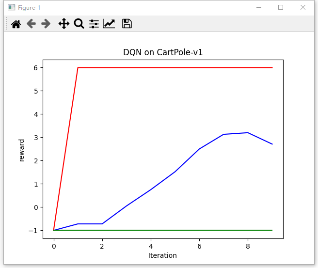
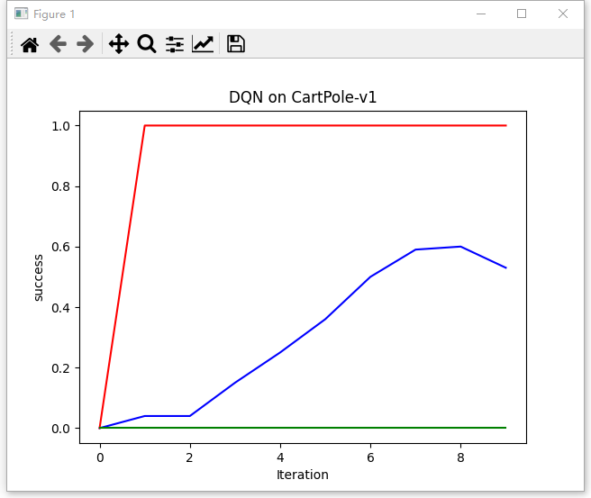
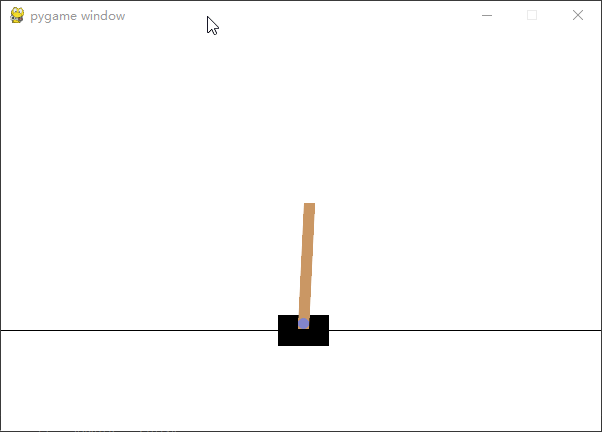

# DQN 算法原理与代码

## 1. 基本原理
深度 Q 学习（Deep Q - Learning，简称 DQN）是强化学习领域中结合了 **深度学习** 与 **Q - Learning** 的算法。其核心目标在于借助深度神经网络来近似 Q 函数，从而克服传统 Q - Learning 在处理大规模或连续状态空间时所面临的计算难题。

DQN 的核心思想是采用深度神经网络（通常为卷积神经网络或者多层感知机）作为函数逼近器，用以估计动作 - 值函数（action - value function），也就是 Q 函数。该网络的输入为环境的状态，输出则是每个可能动作的预期奖励。

## 2. 算法流程
1. **初始化网络**：初始化 Q 网络和目标 Q 网络。
2. **回合循环**：对于每一回合进行如下操作：
    - **初始化状态**：初始化状态 $s$。
    - **步骤循环**：对于每一步进行以下操作：
        - **选择动作**：依据 $\epsilon$-贪婪策略选择动作 $a$。
        - **执行动作与观察**：执行动作 $a$，观察新的状态 $s'$ 和奖励 $r$。
        - **存储转换**：将转换 $(s, a, r, s')$ 存储在回放缓冲区中。
        - **更新状态**：将状态更新为 $s'$。
        - **抽取样本**：从回放缓冲区中随机抽取一批转换。
        - **计算目标值**：使用目标 Q 网络计算目标值。
        - **更新 Q 网络**：使用梯度下降更新 Q 网络。
    - **更新目标 Q 网络**：每隔一定步数，使用 Q 网络的权重更新目标 Q 网络。

## 3. 优缺点
### 3.1 优点
- **处理复杂状态空间**：DQN 通过运用深度神经网络，能够处理高维度和连续的状态空间，极大地拓展了 Q - Learning 的应用范围。
- **稳定训练过程**：DQN 采用经验回放（Experience Replay）和固定 Q - 目标（Fixed Q - Targets）技术，有效稳定了训练过程，解决了数据相关性和目标漂移问题。

### 3.2 缺点
- **超参数敏感**：DQN 对超参数的选择极为敏感，例如学习率、回放缓冲区大小、折扣因子等。
- **连续动作处理能力弱**：DQN 难以很好地处理连续动作空间的问题，针对此情况，需要使用其他算法，如深度确定性策略梯度（DDPG）。

## 4. 游戏（CartPole - v1）
CartPole - v1 是 OpenAI Gym 提供的经典强化学习环境。在该环境中，任务是通过向左或向右移动小车来保持直立的杆子不倒下。

### 4.1 状态空间
CartPole - v1 的状态空间是连续的，由四个实数值组成：
- 小车的位置（Cart Position），范围是 - 4.8 到 4.8。
- 小车的速度（Cart Velocity），范围是 - Inf 到 Inf。
- 杆子的角度（Pole Angle），范围是 - 24 度到 24 度。
- 杆子的角速度（Pole Velocity At Tip），范围是 - Inf 到 Inf。

### 4.2 动作空间
CartPole - v1 的动作空间是离散的，有两个可能的动作：
- 向左移动小车（Push cart to the left）。
- 向右移动小车（Push cart to the right）。

### 4.3 奖励
每一步，只要杆子还未倒下，就会获得一个奖励（+1）。若杆子倒下或者小车移出屏幕（小车的位置超过 +/- 2.4），游戏便会结束。

### 4.4 目标
CartPole - v1 的目标是尽可能长时间保持杆子直立。一般而言，若能在 500 个时间步内保持杆子直立，就可认为解决了该任务。若是 CartPole - v0，只需 200 个时间步。

总体而言，CartPole - v1 是相对简单的环境，但为学习和理解强化学习的基本概念，如状态空间、动作空间、奖励、策略、学习算法等，提供了良好的平台。


## 5. 训练+测试效果
## 训练：

reward曲线:



success曲线:



其中，红色绿色为最大值和最小值，蓝色为平均值。

## 测试：

游戏测试可视化:




## 6. 代码

以下是使用 PyTorch 实现 DQN 算法解决 CartPole - v1 环境的代码:

config_DQN.py:

```python
import os
import torch


#game_name = 'CartPole-v0'
game_name = 'CartPole-v1'
method_name = 'DQN'

# == buffer
buffer_size = 10000
minimal_size = 500
batch_size = 64

# == model
hidden_dim = 128
device = torch.device("cuda") if torch.cuda.is_available() else torch.device("cpu")

target_update = 10
epsilon = 0.01
gamma = 0.98
lr = 2e-3


# == iteration
iteration_num = 10  # 迭代次数
episode_num = 100    # 单次迭代的游戏局数

max_step_num = None  # 单局的最大步长， None 表示不限制
if game_name == 'CartPole-v0':
    max_step_num = 200  
elif game_name == 'CartPole-v1':
    max_step_num = 500 


# == path
dir_data = './data/' + method_name
dir_out = './output/' + method_name + '_' + game_name
dir_models = dir_out + '/models'
dir_figures = dir_out + '/figures'
model_path = dir_out + '/models/lastest.pt'
train_result_path = dir_out + '/train_result.csv'
train_figure_path = dir_out + '/train_figure.png'
test_result_path = dir_out + '/test_result.csv'


if not os.path.exists(dir_models): os.makedirs(dir_models)
if not os.path.exists(dir_figures): os.makedirs(dir_figures)
```

04_DQN.py:
```python
import os
import time
import random
#import gym
import gymnasium as gym
import numpy as np
import collections
from tqdm import tqdm
import torch
import torch.nn.functional as F
import matplotlib.pyplot as plt


from data.configs.config_DQN import *


class ReplayBuffer:
    ''' 经验回放池 '''
    def __init__(self, capacity):
        self.buffer = collections.deque(maxlen=capacity)  # 队列,先进先出

    def add(self, state, action, reward, next_state, done):  # 将数据加入buffer
        self.buffer.append((state, action, reward, next_state, done))

    def sample(self, batch_size):  # 从buffer中采样数据,数量为batch_size
        transitions = random.sample(self.buffer, batch_size)
        state, action, reward, next_state, done = zip(*transitions)
        b_s, b_a, b_r, b_ns, b_d = np.array(state), action, reward, np.array(next_state), done
        transition_dict = {
            'states': b_s,
            'actions': b_a,
            'next_states': b_ns,
            'rewards': b_r,
            'dones': b_d
        }
        return transition_dict

    def size(self):  # 目前buffer中数据的数量
        return len(self.buffer)


class Qnet(torch.nn.Module):
    ''' 只有一层隐藏层的Q网络 '''
    def __init__(self, state_dim, hidden_dim, action_dim):
        super(Qnet, self).__init__()
        self.fc1 = torch.nn.Linear(state_dim, hidden_dim)
        self.fc2 = torch.nn.Linear(hidden_dim, action_dim)

    def forward(self, x):
        #print(' ---- x.shape: ', x.shape)
        x = F.relu(self.fc1(x))  # 隐藏层使用ReLU激活函数
        return self.fc2(x)


class DQN:
    ''' DQN算法 '''
    def __init__(self, state_dim, hidden_dim, action_dim, learning_rate, gamma,
                 epsilon, target_update, device):
        self.state_dim = state_dim
        self.hidden_dim = hidden_dim
        self.action_dim = action_dim
        self.q_net = Qnet(state_dim, hidden_dim,
                          self.action_dim).to(device)  # Q网络
        # 目标网络
        self.target_q_net = Qnet(state_dim, hidden_dim,
                                 self.action_dim).to(device)
        # 使用Adam优化器
        self.optimizer = torch.optim.Adam(self.q_net.parameters(),
                                          lr=learning_rate)
        self.gamma = gamma  # 折扣因子
        self.epsilon = epsilon  # epsilon-贪婪策略
        self.target_update = target_update  # 目标网络更新频率
        self.count = 0  # 计数器,记录更新次数
        self.device = device

    def take_action(self, state, is_epsilon = True):  # epsilon-贪婪策略采取动作
        if is_epsilon  and np.random.random() < self.epsilon:
            action = np.random.randint(self.action_dim)
        else:
            state = torch.tensor([state], dtype=torch.float).to(self.device)
            action = self.q_net(state).argmax().item()
        return action

    def update(self, transition_dict):
        states = torch.tensor(transition_dict['states'], dtype=torch.float).to(self.device)
        actions = torch.tensor(transition_dict['actions']).view(-1, 1).to(self.device)
        rewards = torch.tensor(transition_dict['rewards'], dtype=torch.float).view(-1, 1).to(self.device)
        next_states = torch.tensor(transition_dict['next_states'], dtype=torch.float).to(self.device)
        dones = torch.tensor(transition_dict['dones'], dtype=torch.float).view(-1, 1).to(self.device)

        q_values = self.q_net(states).gather(1, actions)  # Q值

        # 下个状态的最大Q值
        max_next_q_values = self.target_q_net(next_states).max(1)[0].view(-1, 1)
        q_targets = rewards + self.gamma * max_next_q_values * (1 - dones )  # TD误差目标
        dqn_loss = torch.mean(F.mse_loss(q_values, q_targets))  # 均方误差损失函数
        self.optimizer.zero_grad()  # PyTorch中默认梯度会累积,这里需要显式将梯度置为0
        dqn_loss.backward()  # 反向传播更新参数
        self.optimizer.step()

        if self.count % self.target_update == 0:
            self.target_q_net.load_state_dict(
                self.q_net.state_dict())  # 更新目标网络
        self.count += 1

    def save_model(self, model_path):
        torch.save(self.q_net.state_dict(), model_path)

    def load_model(self, model_path):
        state_dict = torch.load(model_path)
        self.q_net.load_state_dict(state_dict, False)


def cal_reward(state, _reward, done, step_num, max_step_num):
    reward = _reward 
    if step_num >= max_step_num-1:  reward += reward*5      # 完成最后一步给更多奖励
    elif done : reward = -1   # 如果 提前结束， 负分            

    return reward


def plot_figure(results):
    keys = ['reward', 'success']
    for k in keys:
        iteration_list = list(range(len(results['ave_'+k])))
        plt.plot(iteration_list, results['ave_'+k], color='b', label='ave_'+k)
        plt.plot(iteration_list, results['max_'+k], color='r', label='max_'+k)
        plt.plot(iteration_list, results['min_'+k], color='g', label='min_'+k)
        plt.xlabel('Iteration')
        plt.ylabel(k)
        plt.title('DQN on {}'.format(game_name, k))
        plt.show()

        figure_path = train_figure_path.replace('.png', '_{}.png'.format(k))
        plt.savefig(figure_path)


def train():    
    # ==== env
    env = gym.make(game_name)

    # ==== seed
    random.seed(0)
    np.random.seed(0)
    #env.seed(0)
    torch.manual_seed(0)

    # ==== buffer
    replay_buffer = ReplayBuffer(buffer_size)

    # ==== agent
    state_dim = env.observation_space.shape[0]
    action_dim = env.action_space.n
    agent = DQN(state_dim, hidden_dim, action_dim, lr, gamma, epsilon,
                target_update, device)

    results = {}
    for k in ['reward', 'success']:
        results['ave_' + k] = []
        results['max_' + k] = []
        results['min_' + k] = []

    for i in range(iteration_num):
        with tqdm(total=episode_num, desc='Iteration %d' % i) as pbar:
            rewards, successes = [], []
            for i_episode in range(episode_num):
                #state = env.reset()
                state, _ = env.reset()

                for step_num in range(max_step_num):
                    # ==== action
                    action = agent.take_action(state)

                    # ==== step
                    #next_state, reward, done, _ = env.step(action)
                    next_state, _reward, terminated, truncated, _ = env.step(action)
                    done = terminated or truncated

                    # ==== reward
                    reward = cal_reward(next_state, _reward, done, step_num, max_step_num)

                    # ==== buffer
                    replay_buffer.add(state, action, reward, next_state, done)

                    # ==== 当buffer数据的数量超过一定值后,才进行Q网络训练
                    if replay_buffer.size() > minimal_size:
                        transition_dict = replay_buffer.sample(batch_size)
                        agent.update(transition_dict)

                    state = next_state
                    if done : break

                success = 0
                if step_num >= 499 :
                    success = 1
                successes.append(success)
                rewards.append(reward)

                ave_reward = np.mean(rewards)
                max_reward = max(rewards)
                min_reward = min(rewards)
                ave_success = np.mean(successes)
                max_success = max(successes)
                min_success = min(successes)

                if (i_episode + 1) % 10 == 0:
                    pbar.set_postfix({
                        'episode':  '%d' % (episode_num * i + i_episode + 1),
                        '  reward':   '%.3f' % ave_reward,
                        'max_r': max_reward,
                        'min_r': min_reward,
                        '  success':  '%.3f' % ave_success,
                        'max_s': max_success,
                        'min_s': min_success,
                    })
                pbar.update(1)

            results['ave_reward'].append(ave_reward)
            results['max_reward'].append(max_reward)
            results['min_reward'].append(min_reward)
            results['ave_success'].append(ave_success)
            results['max_success'].append(max_success)
            results['min_success'].append(min_success)


    agent.save_model(model_path)
    plot_figure(results)


def test():
    env_play = gym.make(game_name, render_mode='human')   # UI
    state, _ = env_play.reset()

    # ==== agent
    state_dim = env_play.observation_space.shape[0]
    action_dim = env_play.action_space.n
    agent = DQN(state_dim, hidden_dim, action_dim, lr, gamma, epsilon,
                target_update, device)
    agent.load_model(model_path)

    time.sleep(10)

    step_num = -1
    done = False
    while not done:
        step_num += 1

        action = agent.take_action(state, is_epsilon=False)
        next_state, reward, terminated, truncated, info = env_play.step(int(action))
        done = terminated or truncated
        state = next_state

        print(' Test ---- step_num, action, reward, obs, done: ', step_num, action, reward, state, done)

        time.sleep(0.1)


if __name__ == '__main__':
    train()

    test()
```

## print:

```python
Iteration 0: 100%|███████████████████████████████████████████████| 100/100 [00:00<00:00, 210.53it/s, episode=100,   reward=-1.000, max_r=-1, min_r=-1,   success=0.000, max_s=0, min_s=0] 
Iteration 1: 100%|█████████████████████████████████████████████████| 100/100 [00:13<00:00,  7.34it/s, episode=200,   reward=-0.720, max_r=6, min_r=-1,   success=0.040, max_s=1, min_s=0] 
Iteration 2: 100%|█████████████████████████████████████████████████| 100/100 [00:24<00:00,  4.02it/s, episode=300,   reward=-0.720, max_r=6, min_r=-1,   success=0.040, max_s=1, min_s=0] 
Iteration 3: 100%|██████████████████████████████████████████████████| 100/100 [00:27<00:00,  3.62it/s, episode=400,   reward=0.050, max_r=6, min_r=-1,   success=0.150, max_s=1, min_s=0] 
Iteration 4: 100%|██████████████████████████████████████████████████| 100/100 [00:28<00:00,  3.50it/s, episode=500,   reward=0.750, max_r=6, min_r=-1,   success=0.250, max_s=1, min_s=0] 
Iteration 5: 100%|██████████████████████████████████████████████████| 100/100 [00:22<00:00,  4.39it/s, episode=600,   reward=1.520, max_r=6, min_r=-1,   success=0.360, max_s=1, min_s=0] 
Iteration 6: 100%|██████████████████████████████████████████████████| 100/100 [00:28<00:00,  3.55it/s, episode=700,   reward=2.500, max_r=6, min_r=-1,   success=0.500, max_s=1, min_s=0] 
Iteration 7: 100%|██████████████████████████████████████████████████| 100/100 [00:29<00:00,  3.39it/s, episode=800,   reward=3.130, max_r=6, min_r=-1,   success=0.590, max_s=1, min_s=0] 
Iteration 8: 100%|██████████████████████████████████████████████████| 100/100 [00:32<00:00,  3.09it/s, episode=900,   reward=3.200, max_r=6, min_r=-1,   success=0.600, max_s=1, min_s=0] 
Iteration 9: 100%|█████████████████████████████████████████████████| 100/100 [00:41<00:00,  2.44it/s, episode=1000,   reward=2.710, max_r=6, min_r=-1,   success=0.530, max_s=1, min_s=0] 
qt.svg: Cannot read file 'D:/Installed/Miniconda3/lib/site-packages/matplotlib/mpl-data/images/matplotlib.svg', because: Encountered incorrectly encoded content. (line 1)
qt.svg: Cannot read file 'D:/Installed/Miniconda3/lib/site-packages/matplotlib/mpl-data/images/matplotlib.svg', because: Encountered incorrectly encoded content. (line 1)
qt.svg: Cannot read file 'D:/Installed/Miniconda3/lib/site-packages/matplotlib/mpl-data/images/matplotlib.svg', because: Encountered incorrectly encoded content. (line 1)
qt.svg: Cannot read file 'D:/Installed/Miniconda3/lib/site-packages/matplotlib/mpl-data/images/matplotlib.svg', because: Encountered incorrectly encoded content. (line 1)
qt.svg: Cannot read file 'D:/Installed/Miniconda3/lib/site-packages/matplotlib/mpl-data/images/matplotlib.svg', because: Encountered incorrectly encoded content. (line 1)
qt.svg: Cannot read file 'D:/Installed/Miniconda3/lib/site-packages/matplotlib/mpl-data/images/matplotlib.svg', because: Encountered incorrectly encoded content. (line 1)
 Test ---- step_num, action, reward, obs, done:  0 1 1.0 [ 0.00341437  0.15488905  0.00846848 -0.28279167] False
 Test ---- step_num, action, reward, obs, done:  1 1 1.0 [ 0.00651216  0.3498892   0.00281265 -0.5727917 ] False
 Test ---- step_num, action, reward, obs, done:  2 1 1.0 [ 0.01350994  0.5449716  -0.00864319 -0.86458725] False
 Test ---- step_num, action, reward, obs, done:  3 1 1.0 [ 0.02440937  0.7402101  -0.02593493 -1.1599752 ] False
 Test ---- step_num, action, reward, obs, done:  4 0 1.0 [ 0.03921358  0.5454355  -0.04913443 -0.8755355 ] False
...
 Test ---- step_num, action, reward, obs, done:  495 0 1.0 [-0.96470857 -0.04944998  0.00179182  0.21341997] False
 Test ---- step_num, action, reward, obs, done:  496 1 1.0 [-0.9656976   0.1456463   0.00606022 -0.0786972 ] False
 Test ---- step_num, action, reward, obs, done:  497 1 1.0 [-0.96278465  0.34068087  0.00448627 -0.36946195] False
 Test ---- step_num, action, reward, obs, done:  498 0 1.0 [-0.95597106  0.14549546 -0.00290297 -0.07536785] False
 Test ---- step_num, action, reward, obs, done:  499 0 1.0 [-0.9530611  -0.04958476 -0.00441032  0.21639778] True
```

## reference
[1] https://github.com/boyu-ai/Hands-on-RL

