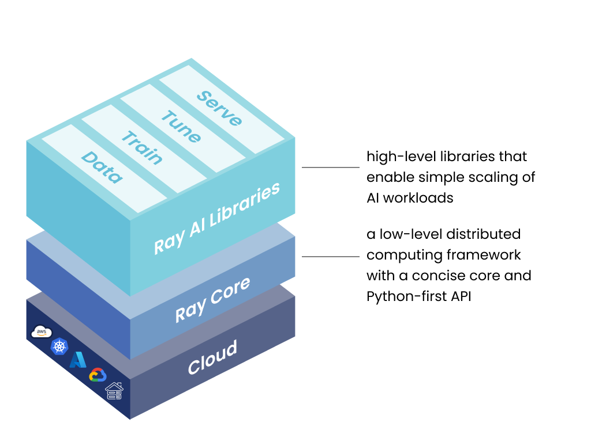
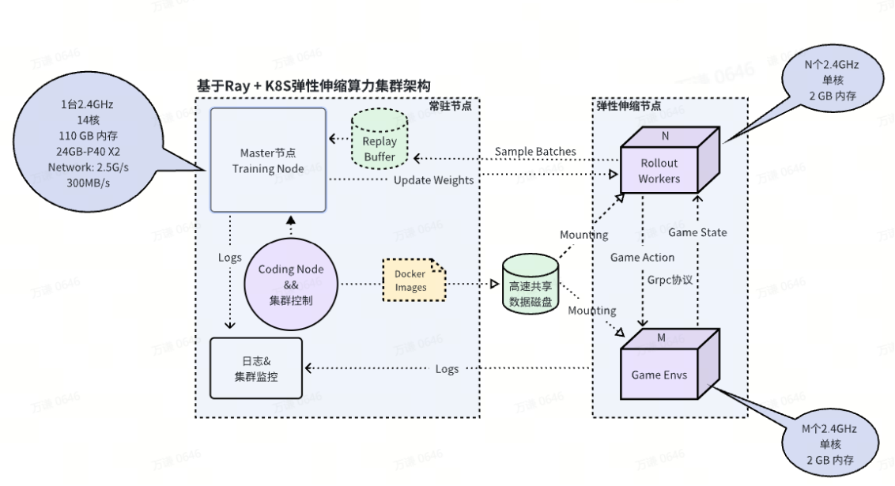
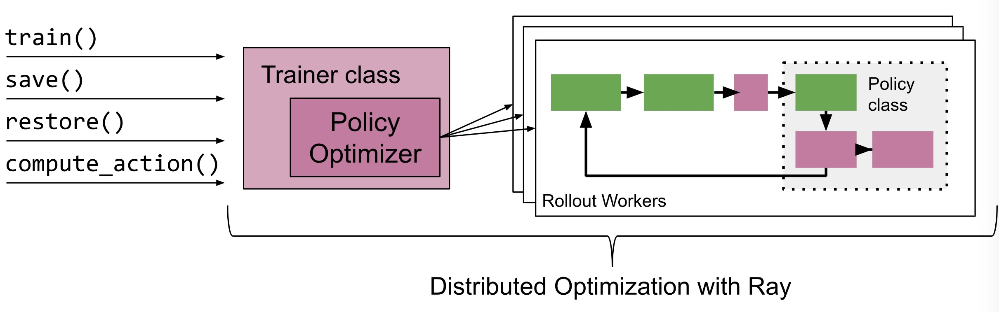

## 基于 Ray 的强化学习分布式训练




### 引言

强化学习 (Reinforcement Learning, RL) 是一种强大的机器学习方法，广泛应用于游戏 AI、机器人控制和自动化决策等领域。然而，随着任务复杂度和环境规模的增加，单机训练的计算能力往往不足以满足需求。这时，分布式训练成为一个重要的解决方案，它能够通过多节点、多 GPU 的协作显著加速训练过程。

[Ray](https://docs.ray.io/) 是一个开源的分布式计算框架，专为构建可扩展的分布式应用而设计。Ray 提供了简单高效的 API，可以轻松实现分布式强化学习训练。本博客将详细探讨如何基于 Ray 进行强化学习的分布式训练。

---

### 一、为什么选择 Ray？

Ray 作为一个灵活的分布式计算框架，天然适合强化学习的分布式需求，以下是它的重要特性：
1. **简单易用的 API**：Ray 提供了抽象化的分布式计算接口，例如 `ray.remote` 修饰符，可以轻松将函数或类分布到多个节点。
2. **内置强化学习库 Ray RLlib**：Ray 提供了 RLlib，一个专用的分布式强化学习库，支持多种主流算法（例如 PPO、A3C、DQN 等）。我们之前介绍的强化学习算法比如 策略优化、TRPO、PPO等都是基于pytorch 手搓的。
3. **支持多种硬件**：Ray 可以无缝支持 CPU、GPU 和多节点集群，适用于从笔记本电脑到超级计算机的多种场景。
4. **灵活的扩展性**：Ray 支持自定义训练逻辑，便于实现复杂的强化学习任务。
5. **生态系统支持**：Ray 还包括 Tune（超参数调优）、Serve（服务部署）等有用的工具，可以很好地扩展强化学习应用。

---

### 二、强化学习分布式训练的基本概念

在强化学习分布式训练中，任务通常包括以下几个组件：
1. **环境 (Environment)**：用于模拟智能体与环境的交互。
2. **智能体 (Agent)**：负责从环境中收集数据并学习策略。
3. **经验回放 (Replay Buffer)**：存储智能体的交互数据，用于训练。
4. **学习器 (Learner)**：负责从经验中学习策略或价值函数。

分布式强化学习的目标是通过多个智能体（或工作节点）并行采样环境，增加数据生成的吞吐量，并通过集中式的学习器快速更新策略以加速训练。

---

### 三、基于 Ray 构建分布式训练架构




在实际训练中，我们可以基于 Ray 构建一个典型的分布式强化学习架构 ，包括以下几个步骤：

1. **安装和初始化 Ray**  
   首先，需要安装 Ray 并初始化分布式环境：
   ```bash
   pip install ray[rllib]
   pip install gym  # 安装 Gym 环境
   ```

   初始化 Ray：
   ```python
   import ray
   ray.init()  # 初始化 Ray，默认使用本地资源
   ```

   如果是在集群环境中，可以通过以下命令启动 Ray 集群：
   ```bash
   ray start --head  # 在主节点启动 Ray
   ray start --address=<主节点地址:端口>  # 在工作节点连接主节点
   ```

2. **定义环境与智能体**  
   使用 Gym 环境作为示例：
   ```python
   import gym
   import numpy as np
   from ray.rllib.agents.ppo import PPOTrainer

   # 定义 Gym 环境
   def create_env(env_name):
       return gym.make(env_name)

   gym_env_name = "CartPole-v1"
   env = create_env(gym_env_name)
   ```

   RLlib 提供了现成的训练器（Trainer）类，例如 PPO、DQN 等，可以直接用于强化学习算法的训练：
   ```python
   config = {
       "env": gym_env_name,  # 环境名称
       "num_workers": 4,  # 并行工作线程数
       "framework": "torch",  # 使用 PyTorch 作为深度学习框架
       "train_batch_size": 4000,  # 每次训练的批量大小
       "sgd_minibatch_size": 128,  # 最小的训练 batch
       "num_sgd_iter": 10,  # 每次更新的迭代次数
       "rollout_fragment_length": 200,  # 每次 rollout 的序列长度
   }

   # 创建 PPO 训练器
   trainer = PPOTrainer(config=config)
   ```

3. **分布式训练**  
   开始训练并实时打印结果：
   ```python
   for i in range(100):  # 训练 100 个迭代
       result = trainer.train()  # 运行单次训练
       print(f"Iteration {i}: episode_reward_mean = {result['episode_reward_mean']}")
   ```

   保存和加载训练的模型：
   ```python
   # 保存模型
   checkpoint = trainer.save()
   print(f"Checkpoint saved at {checkpoint}")

   # 加载模型
   trainer.restore(checkpoint)
   ```

4. **在集群中扩展训练**  
   在集群中，我们可以利用多个节点的资源，将训练完全分布化。通过调整 `num_workers` 参数，可以快速扩展工作线程的数量。例如：
   ```python
   config["num_workers"] = 16  # 使用 16 个并行采样工作者
   trainer = PPOTrainer(config=config)
   ```

   Ray 会自动将工作线程分配到不同的节点，并管理通信。

---

### 四、高级应用：自定义分布式强化学习架构




在一些复杂任务中，RLlib 的默认训练器可能无法满足需求。Ray 支持自定义分布式架构，我们可以通过 `ray.remote` 装饰符手动实现以下组件：

1. **分布式环境采样器**  
   定义一个分布式采样器来并行生成数据：
   ```python
   @ray.remote
   class Sampler:
       def __init__(self, env_name):
           self.env = gym.make(env_name)

       def sample(self, policy, steps):
           observations, actions, rewards = [], [], []
           for _ in range(steps):
               obs = self.env.reset()
               for _ in range(100):  # 限制每次 episode 最大步数
                   action = policy(obs)
                   next_obs, reward, done, _ = self.env.step(action)
                   observations.append(obs)
                   actions.append(action)
                   rewards.append(reward)
                   obs = next_obs
                   if done:
                       break
           return np.array(observations), np.array(actions), np.array(rewards)
   ```

2. **集中式学习器**  
   定义一个集中式学习器，负责更新策略：
   ```python
   @ray.remote
   class Learner:
       def __init__(self, policy_model):
           self.policy = policy_model

       def update_policy(self, data):
           # 使用采样数据更新策略
           observations, actions, rewards = data
           self.policy.train(observations, actions, rewards)

       def get_policy(self):
           return self.policy
   ```

3. **分布式训练架构**  
   结合采样器与学习器，构建分布式强化学习架构：
   ```python
   # 启动多个采样器
   samplers = [Sampler.remote(gym_env_name) for _ in range(4)]

   # 启动集中式学习器
   learner = Learner.remote(policy_model=...)

   # 分布式训练
   for epoch in range(100):
       data_batches = ray.get([sampler.sample.remote(learner.get_policy.remote(), 1000) for sampler in samplers])
       for data in data_batches:
           learner.update_policy.remote(data)
   ```

---

### 五、性能调优与注意事项

在实际应用中，应注意以下几点：
1. **资源分配优化**：
   - 使用 `ray.init(num_cpus=...)` 和 `ray.init(num_gpus=...)` 明确指定资源。
   - 确保采样器和学习器的资源分配合理，避免资源瓶颈。

2. **分布式通信开销**：
   - 增加 `rollout_fragment_length` 和 `train_batch_size`，减少采样器与学习器之间的数据传输频率。
   - 使用高效序列化框架（如 Arrow 格式）优化数据传输性能。

3. **超参数调整**：
   - 根据任务特性调整 `num_workers` 和 `train_batch_size` 的大小，找到性能与稳定性的平衡。

4. **环境复杂度**：
   - 对复杂环境应优先考虑 GPU 加速，并根据计算资源合理分配。

---

### 六、总结与展望

Ray 强大的分布式计算能力为强化学习的高效训练提供了极大的便利。通过简单的 API，开发者可以轻松构建从单机到集群的分布式训练架构。无论是使用 RLlib 提供的现成训练器，还是实现自定义的复杂分布式架构，Ray 都能很好地满足需求。

未来，随着强化学习任务的复杂度不断提高，分布式训练将成为主流，而 Ray 的灵活性和扩展性无疑会在这一领域扮演重要角色。

---

### 附录：参考资源

1. [Ray 官方文档](https://docs.ray.io/)
2. [RLlib 官方文档](https://docs.ray.io/en/latest/rllib/index.html)
3. [OpenAI Gym](https://gym.openai.com/)
4. [Ray 分布式强化学习示例](https://github.com/ray-project/ray/tree/master/rllib/examples)

